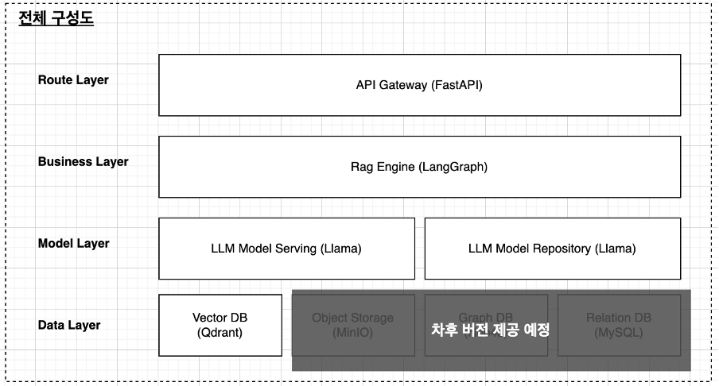
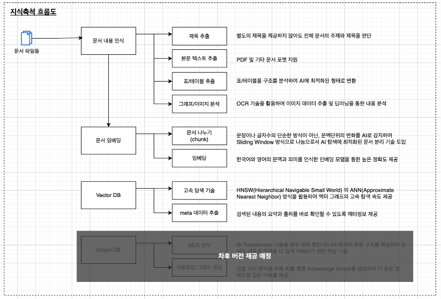
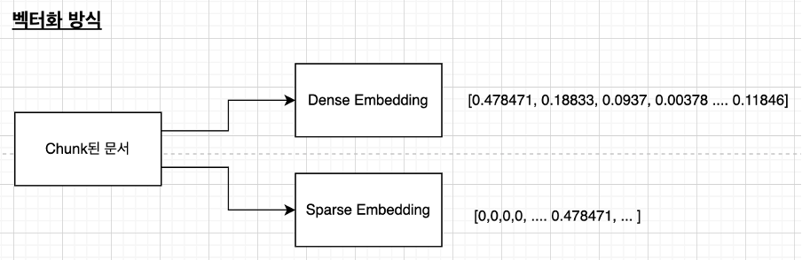
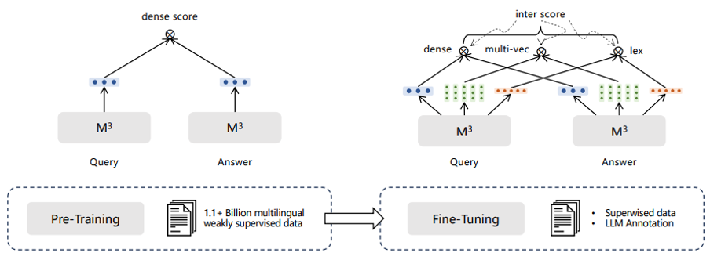
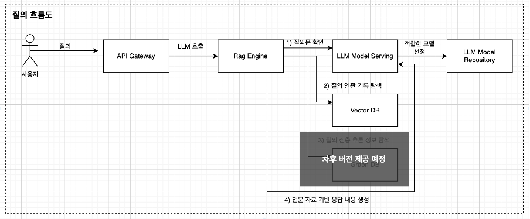
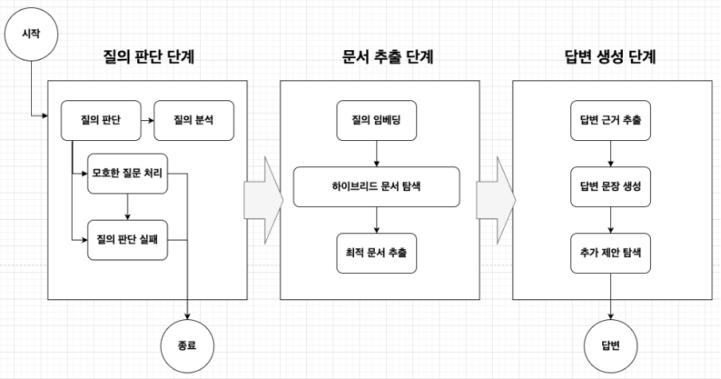

# 문서 분석 AI 기술문서

## 문서 갱신일

- 2025.08.02 문서 생성  
- 2025.08.25 정보 검색 고도화 내용 반영  
- 2025.08.30 한계/제약 사항 기술 추가(LLM 성능으로 인한 문제 부분 기술)  
- 2025.11.12 솔루션 설치 방법 추가

# 개요

## 시스템의 목표

 본 시스템은 개인정보 및 사내 기밀문서 보호를 위해 폐쇄망 내에서 외부로의 데이터 유출 없이 기업이나 조직의 정보를 분석 하기 위한 시스템 입니다.

## 데이터베이스 검색/검색엔진 과의 차이점

 데이터베이스나 검색엔진은 단순히 text를 인덱싱 하거나 여러 속성들을 검색엔진을 이용해 인덱싱한 정보를 ‘검색’하는 단계에 머물러 있다면, 문서 분석 AI는 1\)사용자의 질의를 분석하여 2\)적합한 데이터를 탐색하고 탐색된 데이터를 기반으로 3\)고객에 질문에 적합한 분석 결과를 반환 하는 것 입니다.

## 제공 기능

 이러한 목표를 위해 문서 분석 AI는 아래와 같은 기능 들을 제공 합니다.

- PDF 문서 데이터베이스화  
- 사용자 질문 파악  
- 최적화된 데이터 chunk  
- 질문의 맥락과 키워드의 하이브리드 탐색  
- 기능 모듈화를 통한 손쉬운 LLM 모델 선택

## 시스템의 한계

현 시스템 목표 범위를 벗어난 아래의 내용은 제공하고 있지 않습니다.

- 외부 문서 탐색  
- 문서 검색 이외의 질의 (예\> 코딩)

또한 아래의 기능은 현재 버전에서는 제공하고 있지 않습니다.

- 연속적인 대화를 통한 질답  
- PDF 이외의 문서 포맷  
- 이미지나 복잡한 표나 차트의 분석  
- 대규모 사용자의 동시 작업

## LLM 모델 특성과 본 시스템 적용 방안

### 1\. LLM 특성 비교

| 구분 | 상용 LLM (예: ChatGPT) | 오픈소스 Local LLM |
| :---- | :---- | :---- |
| 파라미터 규모 | 수백억\~수천억 (초거대) | 수억\~수십억 수준 |
| 학습 데이터량 | 수십억 문서 이상 (대규모 크롤링 \+ 정제) | 제한적, 공개 데이터 위주 |
| 학습 결과 | 높은 일반 지식·대화 능력 확보 | 특정 영역에서는 성능 부족 |
| 비유 | 대학 교육을 받은 성인 | 초등 교육 단계의 아동 |

### 2\. 학습 방법의 영향

* **기본 훈련**: 일반적인 모델들이 주로 사용 하는 방식  
                주제 A를 입력 → A 관련 답변을 생성하는 방식   
                단순 질문·일반 대화에 적합

* **한계**: 비교·분석·추론이 필요한 질문에는 제약  
  * 예: *“A의 장점은?”* → 답 가능  
    예: *“A가 B, C보다 나은 이유는?”* → 충분한 답변 어려움

### 3\. 한국어 특수성

* 한국어는 **어간+어미 결합** 구조 → 형태소 분석 난이도 ↑  
* 기존 기계학습만으로는 완전한 분석 불가  
* **대규모 파라미터 \+ 방대한 한국어 학습 데이터**를 통해서만 자연스러운 이해·응답 가능 → 대형 모델 필요

### 4\. 본 시스템 요구사항

본 시스템은 단순 대화가 아니라, **복잡한 지시 처리와 문서 기반 답변**을 수행해야 하며. 따라서 LLM은 다음을 충족해야 합니다:

1. 사용자의 질의를 정확히 이해  
2. 적합한 문서를 탐색 후, 지시에 따른 응답 생성  
3. 한국어에 대한 높은 이해도 보유

### 5\. 모델 선택

* **채택 모델:** Google **Gemma-3-27B-Instruct**  
  * 복잡한 Instruction 수행 능력 우수  
  * 한국어 이해도 균형적 확보  
  * 성능과 효율의 균형이 가장 뛰어남  
* **대안 모델:** 사용 목적에 따라 경량·특화 모델 선택도 가능 합니다.

# 기술 스텍

 전체 시스템은 아래와 같이 크게 4개의 레이어로 구성되었으며, 가볍고 빠르게 구동 될 수 있도록 현재 가장 최신 기술과 안정성이 인정되어 널리 사용되는 기술들로 구성하였습니다.



| 모듈명 | 설명 |
| :---- | :---- |
| API Gateway | 전체 서비스 흐름 컨트롤러 |
| Rag Engine | 사용자 질의를 체이닝 하거나 프롬프트를 확장 및 기억등의 다양한 전문화된 기술 제공 |
| LLM Model Serving | 언어모델을 API로 통신하기 위한 서버 |
| LLM Model Repository | 여러 언어모델들을 제공/관리 하는 기능 |
| Vector DB | 훈련 문서 검색용 데이터베이스 |
| Object Storage | 훈련 문서(PDF) 및 기타 자료 파일 저장소 |
| Graph DB | 훈련 문서 심층 분석 자료 데이터베이스 |
| Relation DB | 각종 고객 질문 처리를 위한 전반적인 기록을 위한 데이터베이스 |

# 

# 작업 흐름도

 전체 흐름은 아래의 2개의 단계를 가집니다.

1. 지식 축척 흐름  
2. 질의 답변 생성 흐름

## 지식 축척 흐름

 AI를 통한 질의와 분석을 위한 자료를 업로드 하는 사전 과정 입니다.  

 내부적으로 업로드한 문서를 1\) Chunk 2\) Document Embedding 3\) Vectorization 의 과정을 거칩니다.   
또한 단순의 의미론상에서 놓칠 수 있는 부분을 보완하기 위해 키워드 검색을 통한 하이브리드 검색을 위한 Dense/Sparse Embbeding을 모두 생성 합니다.   

Dense Embedding

- 문장/문단의 의미를 고차원의 벡터 공간에 두어, text의 차이보다 그 의미를 적절히 추출 하기 위한 기술

Sparse Embedding

- 각 토큰(단어)의 중요도 가중치를 학습하여 키워드 기반 검색 기술  
- Tokenization과 TF-IDF나 BM25같은 기술들을 통해 중요 단어를 추출하여 핵심 키워드를 찾아냄

현 시스템에서 사용하고 있는 임베딩 기술은 최신 Transformer 방식중 하나인 reBerta 기반의 BGE-M3 모델을 활용하여 다국어에 강력한 벡터를 생성 합니다.  


## 질의 답변 흐름

 사용자의 질의는 아래의 흐름으로 요청되어 답변을 생성합니다.  

 각 기능은 모듈화 되어 있고 API를 통하여 통신하여 독립적으로 운영이 가능하여 시스템 상황에 따라 적절하게 분산 배치가 가능 합니다.

## RAG Graph

 Rag Engine의 경우 최신 LangGraph 기술을 채택하여 복잡한 질의 과정의 처리에 유연함을 제공 합니다. 다음은 본 시스템의  질의 처리 Graph 입니다.  
 사용자의 질문은 총 3단계 1\) 질의 판단 단계, 2\) 문서 추출 단계, 3\) 답변 생성 단계를 거쳐 사용자에게 답변을 제공하게 됩니다.  
 1단계에서는 사용자의 질문이 답변에 적합한지, 검색에 적합한지 여부등을 판단하고, 필요하면 질문을 분해하여 질문을 좀더 깊게 이해하는 과정을 거칩니다. 본 시스템은 Hybrid Vector 검색을 지원 하기 때문에 문장의 문맥을 이해하는 부분에 적합한 검색과 주제/키워드에 초점을 맞추는 검색에 모두 적합한 검색 방법을 탐색 합니다.  
 2단계에서는 단순 검색이 아닌, 질문을 Dense Vector와 Sparse Vector에 적합한 Embedding을 처리하고 키워드 확장을 통해 좀더 연관성이 높은 문서를 탐색 합니다. 이 과정에서 다양한 알고리즘들을 통해 좀더 사용자의 질문에 적합한 문서를 탐색 합니다.  
 3단계에서는 최종적으로 선택된 문서들을 기반으로 답변을 생성하는 과정입니다. 단순히 yes/no 식의 답변이 아닌, 추출된 근거 문서를 기반으로 수치와 용어들을 인용하여 답변을 생성하는 과정을 거칩니다.



## 문서 탐색 상세 과정

 실제 문서 추출을 위한 과정은 좀더 복잡한 알고리즘 들을 거쳐 선별 됩니다.  
 질의 판단 단계에서 분석된 사용자의 질문은 상세 의도로 분해되고, 각 의도에 맞는 데이터를 각각 다양한 검색하게 됩니다. 대규모로 검색된 데이터를 Hybrid Search \> PRF Expand \> RRF Fuse \> Re-Ranking \> Adaptive Keword Gate \> Min-Score Cut \> Per-Doc Cap 의 7단계를 거쳐 최종적인 후보 근거 문서로 선정 됩니다.  


각 단계별 설명은 아래와 같습니다.

### Hybrid Search

- 단순히 Dense 검색뿐만 아니라 Sparse 검색을 함께 하여, 유사한 문맥이나 의도 뿐만 아니라 키워드와 주제에 초점을 맞춘 검색을 Cosine Similarity를 통해 각각 병렬로 탐색

### PRF: Pseudo Relevance Feedback 알고리즘

- PRF란 검색 알고리즘에 하나로 더 나은 검색 품질을 얻기 위해 검색 결과의 내용을 바탕으로 연관된 검색을 추가로 하는 알고리즘  
- 관련자료, [https://www.sciencedirect.com/science/article/abs/pii/S0306457320308372](https://www.sciencedirect.com/science/article/abs/pii/S0306457320308372)

### RRF: Reciprocal Rank Fusion 알고리즘

- 하이브리드 검색시 생기는 다른 알고리즘 간의 다른 체계의 score를 하나로 통합시키는 과정  
- 관련자료, [https://arxiv.org/abs/2402.03367](https://arxiv.org/abs/2402.03367)  
- 관련자료, [https://apxml.com/courses/advanced-vector-search-llms/chapter-3-hybrid-search-approaches/rrf-fusion-algorithms](https://apxml.com/courses/advanced-vector-search-llms/chapter-3-hybrid-search-approaches/rrf-fusion-algorithms)

### Adapted Keyword Gate

- 문서와 질문의 주요 키워드를 추출하여 유사도를 검사하는 기능  
- Sparse Vector에서 놓친 키워드를 보완하는 유사도 검사

### Min Score Cut

- 쿼리와 동떨어진 문서로 인해 답변의 품질이 떨어지는 것을 방지하기 위한 최소 유사도 기준 설정

### Per-Doc Cap

- 특정 문서에 치중 되어 검색 결과가 제한적으로 되는 것을 막기 위한 안전 장치

# 

# 환경 조건

본 시스템을 운영하기 위해서는 다음의 기술 환경이 필요합니다.

| 시스템명 | 스펙 |
| :---- | :---- |
| OS | Linux 기반 (Ubuntu, CentOS) |
| GPU | Nvidia 계열, 최소 A100 x 2 이상 NVIDIA-SMI version  : 570.158.01 NVML version        : 570.158 DRIVER version      : 570.158.01 CUDA Version        : 12.8 |
| Docker | Version 28.1.1 이상 |
| nvcc  | nvcc: NVIDIA (R) Cuda compiler driver Copyright (c) 2005-2025 NVIDIA Corporation Built on Wed\_Jan\_15\_19:20:09\_PST\_2025 Cuda compilation tools, release 12.8, V12.8.61 Build cuda\_12.8.r12.8/compiler.35404655\_0 |
| Vector DB | Qdrant (docker 기반 구동) |
| 본 시스템 | (docker 기반 구동) |

# 

# 실행 방법

## 선수 조건 (Prerequisite)

- OS, Docker 및 Nvidia 관련 인프라 시스템 구성을 위한 소프트웨어 환경이 준비되어 있다고 가정 합니다. 관련하여서는 HW 공급처 및 인프라 담당자에게 확인 바랍니다.  
- 또한 각 시스템간의 포트들이 방화벽에서 오픈되어 있어야 합니다.

| 시스템 | 포트 | 허용 범위 |
| :---- | :---- | :---- |
| 웹서버 | 80/443 (HTTP/HTTPS) | 사내/외부 접속 허용 |
| API Gateway | 443(HTTPS, WebSocket) | 사내/외부 접속 허용 |
| RagEngine | 11434(변경가능) | 서버간 접속 허용 |
| Vector DB | 6333, 6334 | 서버간 접속 허용 |

## 시스템 설치

본 시스템은 Dockerize 되어 있어, 단순하게 도커를 로딩만 하여 바로 사용 가능합니다.

### Vector DB 설치

```bash
# 설치 명령어
docker run -d -p 6333:6333 -p 6334:6334  -v [디비저장경로]:/qdrant/storage qdrant/qdrant

# 실제 예
docker run -d -p 6333:6333 -p 6334:6334  -v /home/knpu/.jetbrain/qdrant_storage:/qdrant/storage qdrant/qdrant

```

### 본 시스템 설치

```bash
# 도커 이미지 파일 불러오기 (최초 1회만 수행)
docker load -i /path/to/save/myapp_image.tar

# 실행 명령어 (구동시만 수행)
docker run -d --name myapp_container -p [접속포트]:9000 -v [설정파일경로]:/app/config myapp:latest
# 실행 예
docker run -d --name myapp_container -p 80:9000 -v ./docker/config:/app/config myapp:latest

```

# 

# 설정 방법

## LLM 모델 준비 방법

본 시스템은 특정 LLM 모델에 독립적으로 운영 됩니다. 시스템 사양 및 사용자 트래픽에 따라 적절한 모델을 선정하여 사용하실 수 있습니다. 다음은 모델 서버와 모델 파일을 구동하는 방법입니다.

```bash
# ollama 설치
sudo su
    apt install curl -y
    curl -fsSL https://ollama.com/install.sh | sh
ollama --version

```

```bash
# 온라인에서 모델 다운로드
# 모델명은 허깅페이스(https://huggingface.co)에서 검색하기
# 허깅페이스에 없는 모델은 별도 협의 필요
ollama pull gemma3:27b
```

## 본 프로그램의 설정 내용

아래의 4개의 내용을 설정 파일로 변경 가능 합니다:

- embedding.yaml: 임베딩 라이브러리  
- llm.yaml: LLM 모델  
- prompt.yaml: Graph에서 ‘답변생성’ 단계의 프롬프트 명령어  
- vector.yaml: Vector DB 접속 정보

각 설정에 변경은 시스템에 영향을 끼칠 수 있으므로 꼭 기술 담당자와 협의 하여 수정 합니다.

### embedding.yaml

```yaml
bgem3:
  embedding_model: nlpai-lab/kure-v1
  embedding_cls: FlagEmbedding.BGEM3FlagModel
langchain_dense:
  embedding_model: nlpai-lab/kure-v1
  embedding_cls: embedding.bgem3_langchain_embeddings.MyDenseEmbeddings
langchain_sparse:
  embedding_model: nlpai-lab/kure-v1
  embedding_cls: embedding.bgem3_langchain_embeddings.MySparseEmbeddings
sentence_transformers:
  embedding_model: nlpai-lab/kure-v1
  embedding_cls: sentence_transformers.SentenceTransformer
```

### llm.yaml

```yaml
# type 종류, hf, ollama, openai
# 기타 파라미터들
# - 필수: model
# - 선택: temperature, base_url, api_key
# 허깅페이스의 경우 api_key와 HUGGINGFACEHUB_API_TOKEN 환경변수 둘다 없을때, 로컬 허깅페이스를 탐색.
# 허깅페이스 temperature: 1e-5 가 가장 작은값

# default 단계
default:
  type: ollama
  model: sktax40l_q5_k_m
  temperature: 0.0
  base_url: http://172.17.0.1:11434

# loader 단계
loader:
  type: ollama
  model: sktax40l_q5_k_m
  temperature: 0.0
  base_url: http://172.17.0.1:11434

# detect 단계
detect:
  type: ollama
  model: sktax40l_q5_k_m
  temperature: 0.0
  base_url: http://172.17.0.1:11434

# rewrite 단계
rewrite:
  type: ollama
  model: sktax40l_q5_k_m
  temperature: 0.7
  base_url: http://172.17.0.1:11434

# generate 단계
generate:
  type: ollama
  model: sktax40l_q5_k_m
  temperature: 0.2
  base_url: http://172.17.0.1:11434
```

### prompt.yaml

```yaml
detect_clarity: |
  **당신의 작업**
  1. 사용자가 입력한 질문이 얼마나 구체적인지 0‑5점으로 평가하세요.
  2. 질문이 모호(clarity_score ≤ 3)하다면, LLM이 스스로 보강해서 **“완전한 문장”** 형태로
     재작성한 *rewritten_query* 를 만드세요.
  3. 이어서 검색에 바로 넣기 좋은 **대안 쿼리** 1‑3개를 작성하세요.
     - 반드시 한 문장으로, 조사·어미를 포함한 자연어 질문이어야 합니다.
     - 핵심 키워드만 나열하지 마세요.

  ### 평가 기준
  - 0~1점: 핵심 키워드/의도가 없어 거의 해석 불가
  - 2점: 매우 모호하거나, LLM이 답하기 어려움
  - 3점: 비교 기준·상황은 부족하지만, 핵심 키워드와 의도가 분명해서 LLM이 보충추론 가능
  - 4점: 비교 기준/맥락이 어느 정도 포함되어 명확
  - 5점: 매우 구체적(대상, 상황, 비교 기준 모두 명시)

  ### 출력(JSON; key 순서 유지)
  {{
    "clarity_score": <int 0‑5>,
    "rewritten_query": "<string | null>",      // 명확성 4‑5점이면 null
    "alternative_queries": [                   // 0‑3개, 모두 “자연어 문장”
      "<string>",
      …
    ]
  }}

  ### 예시
  사용자 질문: “왜 통행시간 단축이 더 효과적이야?”

  출력 예:
  {{
    "clarity_score": 3,
    "rewritten_query": "통행시간 단축이 교통 정책에서 다른 대안보다 효과적인 이유는 무엇인가요?",
    "alternative_queries": [
      "통행시간을 단축하면 교통 체증이 얼마나 감소하나요?",
      "통행시간 단축 정책과 대중교통 요금 인하 정책을 효과 측면에서 비교해 주세요."
    ]
  }}

  ***질문:***
  ```{question}```

  ***주의사항:***
  - 답변은 반드시 JSON 형식으로만 작성하고 다른 내용은 첨부하지 마세요 (예> **답변:**).

generate_answer_system: |
  당신은 질문과 참고 문서를 바탕으로 간결하면서도 근거 기반의 풍부한 분석 결과를 작성하는 하는 전문가입니다.
  아래의 지침을 반드시 따르세요:
  - 답변은 서론-본론-결론의 자연스러운 흐름을 따르세요.
  - 본론에서는 '첫째', '둘째', '셋째' 등의 자연스러운 연결어를 사용하여 3~4문장 단위로 설명하세요.
  - 각 주장에는 참고 문서의 구체적 근거, 수치, 예시들을 포함하세요.
  - 모든 근거(수치와 예시등을 포함)와 결론에는 반드시 참고 문서의 [문서번호]를 인용하세요.
  - 결론에서는 질문의 핵심을 종합하고 정책적 시사점을 간단히 덧붙이세요.
  - '###', 번호 매기기, 불릿포인트, 굵은 글씨(**) 같은 마크다운 포맷을 사용하지 마세요.
  - 말로 대답하듯 자연스럽게 서술하세요.

generate_answer_human: |
  질문:\n{question}\n\n참고 문서:\n{context}\n\n
```

### vector.yaml

```yaml
host: 172.17.0.1 # docker 내부에서 동일 host 파일에 접속시
port: 6333
collection: pdf_chunks # 문서 저장 테이블명, 특별한 사유가 없는한 수정하지 않기
```
